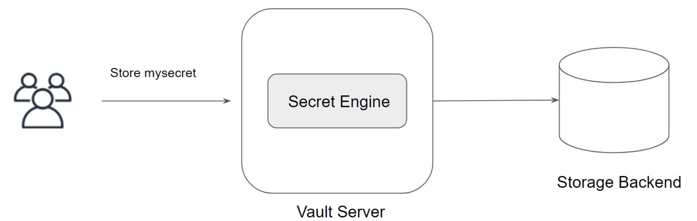
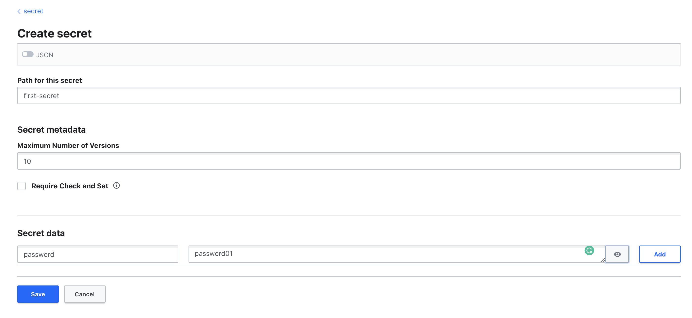

One of the core features of vault is to read and write secrets securely.  

Secret engines are components which store, generate, or encrypt data.  

We can store secret based on a specific search engine and each offers certain features.  



## To add kv secret through GUI



We can create multiple versions for this by clicking on create new version.  

We can switch to any version and also can view the history of the versions. 

We have two options to delete the versions.  

* Delete version - this can be fetched later
* Permanently destroy version - this cannot be fetched

Once we delete the version, we will have the option to undelete version to restore the specific version.  

We can also delete the secret. When we delete the secret, all the versions of the secret are permanently deleted.  

## To add kv secret through CLI

To get all the options of KV    
`vault kv -h`   

```
Create or update the key named "foo" in the "secret" mount with the value
  "bar=baz":

      $ vault kv put secret/foo bar=baz

  Read this value back:

      $ vault kv get secret/foo

  Get metadata for the key:

      $ vault kv metadata get secret/foo

  Get a specific version of the key:

      $ vault kv get -version=1 secret/foo

  Please see the individual subcommand help for detailed usage information.

Subcommands:
    delete               Deletes versions in the KV store
    destroy              Permanently removes one or more versions in the KV store
    enable-versioning    Turns on versioning for a KV store
    get                  Retrieves data from the KV store
    list                 List data or secrets
    metadata             Interact with Vault's Key-Value storage
    patch                Sets or updates data in the KV store without overwriting
    put                  Sets or updates data in the KV store
    rollback             Rolls back to a previous version of data
    undelete             Undeletes versions in the KV store
```

To add a secret   
`vault kv put secret/second-secret user=admin01`.  
`secret/` is the path   
`second-secret` is the secret name   
`user=admin01` is the secret.   

We can the version of this secret by.  
`vault kv put secret/second-secret user=admin02`.                ~(master✗)@Advaiths-MacBook-Pro.local
```
Key              Value
---              -----
created_time     2021-10-01T20:18:31.018434Z
deletion_time    n/a
destroyed        false
version          2
```

To read the secret   
`vault kv get secret/second-secret`.   
```
====== Metadata ======
Key              Value
---              -----
created_time     2021-10-01T20:18:35.772197Z
deletion_time    n/a
destroyed        false
version          3

==== Data ====
Key     Value
---     -----
user    admin03
```
We will get the latest version value.  

To read the version 2 of second-secret.   
`vault kv get -version=2 secret/second-secret`
```
====== Metadata ======
Key              Value
---              -----
created_time     2021-10-01T20:18:31.018434Z
deletion_time    n/a
destroyed        false
version          2

==== Data ====
Key     Value
---     -----
user    admin02
```

To delete a specific version of the secret.   
`vault kv delete -versions=2 secret/second-secret`.  

To undelete the version of the secret.   
`vault kv undelete -h` - for help.    
`vault kv undelete -versions=2 secret/second-secret`.  

We can verify all these changes from CLI or UI.

To permanentky destroy a specific version of secret.  
`vault kv destroy -versions=2 secret/second-secret`.  

To delete the entire secret.   
`vault kv metadata -h` - for help.  
`vault kv metadata delete secret/second-secret`.  

To view all the versions of the secret.  
`vault kv metadata get secret/first-secret`.  

## Basic Commands

Command | Description
--- | ---
`vault kv put secret/second-secret user=admin01` | Stores key value pair at secret/second-secret
`vault kv put secret/second-secret user=admin02` | Stores key value pair at secret/second-secret with version2 identifier 
`vault kv delete secret/second-secret` | Deletes the latest version
`vault kv undelete -versions=2 secret/second-secret` | Restore a specific version of the secret
`vault kv destroy -versions=2 secret/second-secret` | Permanently removes the specified versions data from the key/value secret engine.
`vault kv metadata delete secret/second-secret` | Delete all versions and the metadata for the provided secret.
`vault kv metadata get secret/first-secret` | Shows the metadata of the secret with all versions.  


