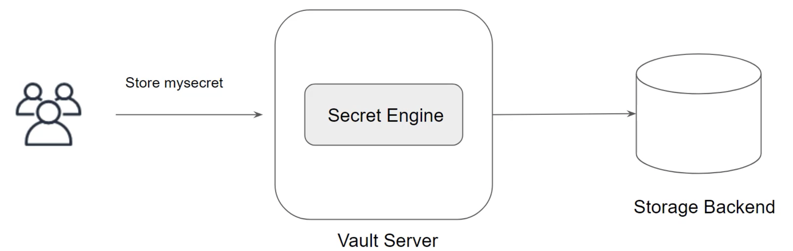

Secret engines are components which store, generate, or encrypt data.  

We can store secret based on a specific search engine and each offers certain features.  

## Secret Engine Types

Each secret engine type provides specific set of features depending on the use-cases.

Some of the secret engines include:

* AWS
* Active Directory
* Databases
* Key/Value
* SSH
* Azure

Secret Engine is enabled at a given path.  
`kv --> mysecret/`.  
Once enabled, the secrets are stored inside the path.  
`vault kv put mysecret/firstsecret mykey=myvalue`.  

## Secret Engine Lifecycle

Most secret engines can be enabled, disabled, tuned and moved via the CLI or API.  

Options | Description
--- | ---
`Enable` | This enables a secret at a given path. By default, they are enabled at their "type" ("aws" enables at "aws/").  
`Disable` | This disables an existing secret engine. When a secret engine is disabled, all of the secrets are revoked and all of the data stored for that engine in the physical storage layer is deleted.
`Move` | This moves the path for an existing secrets engine. This process revokes all secrets, since secret leases are tied to teh path they are created at. The configuration data stored for the engine persists through the move.
`Tune` | This tunes global configuration for the secrets engine such as the TTLs.

## Secret Engine Type - KV (Key / Value)

The kv secrets engine is used to store arbitary secrets within the configured physical storage of vault.    
Key names must always be strings.  
Provides various functionalities like versioning.  

To enable the secret engine.  
`vault secrets enable -version=2 kv`    
or `vault secrets enable kv-v2`.    
or `vault secrets enable -path=demopath -version=2 kv`.    

To diable the secret engine.   
`vault secrets disable demopath/`.   
