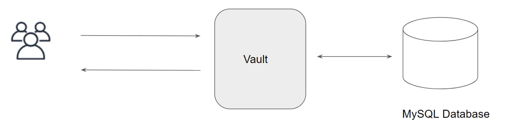

In the KV secret engine, we have to manually store the data.  
Certain engine works based o n dynamic secrets. These secrets do not exist until they are generated.   

Access --> Leases --> revoke lease

### Revoking secrets

vault will automatically revoke this dynamic credentials and this can further be tuned by setting the lease duration.   

Once the secret is revoked, the access keys are no longer valid.   

## AWS

Role indicates what access that accesskey and secretkey generated will have.  
So, while creating a role, we need to define a policy (with all the permissions that role needs to have like accessing ec2, s3..).  

While creating role, we can directly give policy in json format or we can just give policy ARN that needs to be attached to the user (policy ARN from AWS console).

vault needs permissions in AWS to interact with AWS.  

In AWS:  
IAM --> Users --> Add User --> username(vaultuser), management console access --> create user

Once the user is created, one policy will be attached to the user i.e.,IAMUserChangePassword.  
Attach Administrator access policy for the vault user.  

Create access key under vaultuser --> security credentials.
These access key and secret key will be used by vault to interact with AWS.

In vault:
AWS/ --> Configure --> Dynamic IAM root credentials --> provide access and secret keys --> save.

1. Create role in vault
2. Create vaultuser in AWS
3. Create accesskey and secretkey that will be used by vault to interact with AWS. 
4. Configure the keys in vault

Now to dynamically create secrets:  
AWS/ --> click on specific role (based on what access you need) --> Generate.  

Once the keys are generated, in the backend vault will create new IAM user in AWS(if the role type is IAM user).  
This user is created with the policy with which we created the role.  

