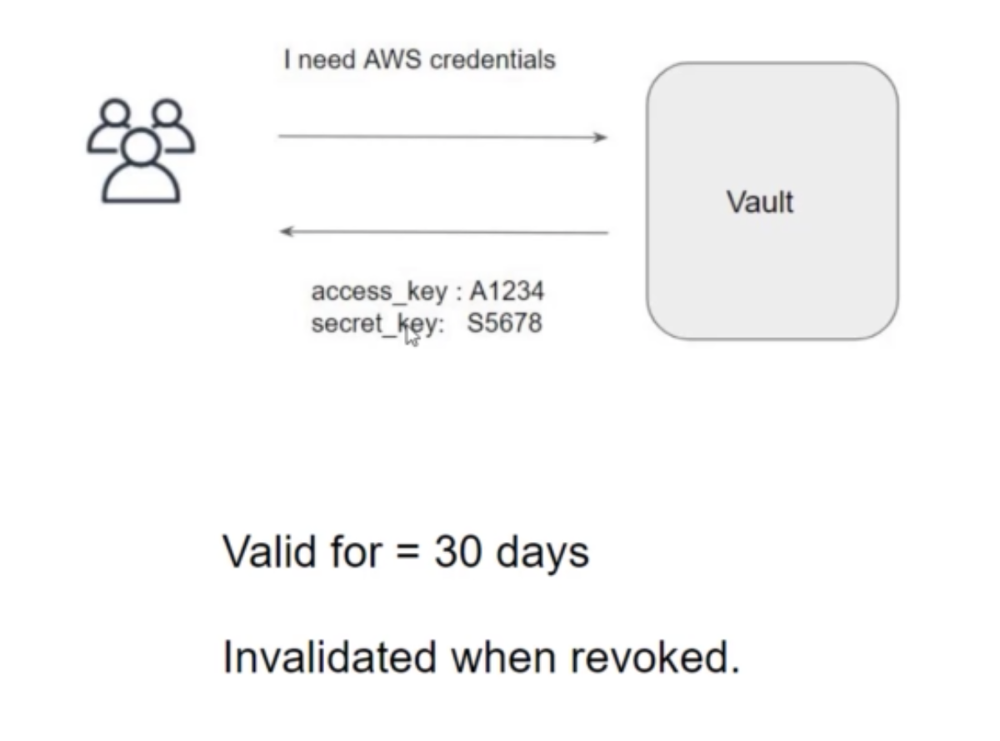

With every dynamic secret and service type authentication token, vault creates a lease: metadata containing information such as a time duration, renewability and more.  
TTL shown is in seconds.  
Once the lease is expired, vault will automatically revoke the data and the consumer of the secret can no longer be certain that it is valid.   

While enabling the AWS secret engine, we have method options, where we can set `Default lease TTL` and `Max Lease TTL.`     

Default lease TTL is the time that the user or secret lives.   
Max lease TTL indicates for how much time, the lease of this sceret can be incremented.

For example:   
Default lease TTL is 1 minute
Max lease TTL is 5 minute.  
After 1 minute of creation of dynamic secret, the secret will be revoked or deleted.  
Within 1 minute of creation of dynamic secret, we can renew the lease of this secret upto 5 minutes..

To renew the lease:   
`vault lease renew --increment=200 <leaseid>`   
We can also renew from GUI Access --> leases --> specific lease.   

`renew`: This command renews the lease on a secret, extending the time that it can be used befire it is revoked by vault.   

`revoke`: When a lease is revoked, it invalidates that secret immediately and prevents any further renewals.   

To revoke lease:  
GUI --> Access --> leases --> specific lease --> revoke lease --> Confirm.  
CLI --> `vault lease revoke <leaseid>`    

## Path Based Revocation  

Lease Management | Description
--- | ---
`vault lease revoke <leaseid>` | Revokes a specific lease
`vault lease revoke -prefix aws/` | Revokes all AWS access keys. All leases under aws/ will be revoked.  

LeaseIDs are structured in a way that their prefix is always the path where the secret is requested from.  

