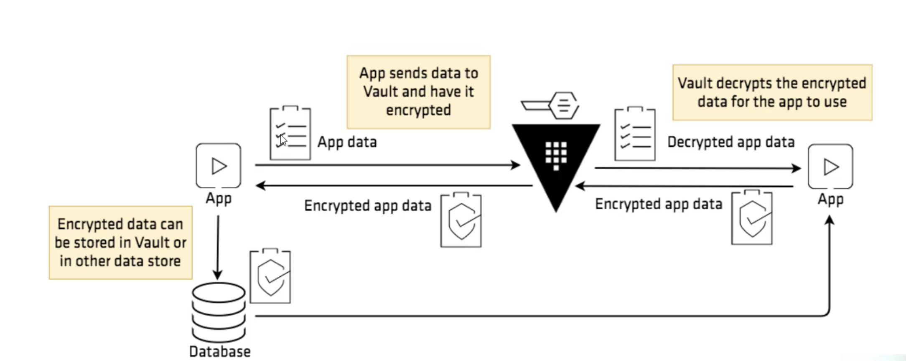
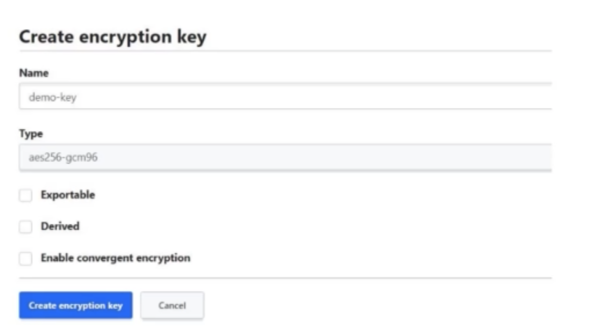
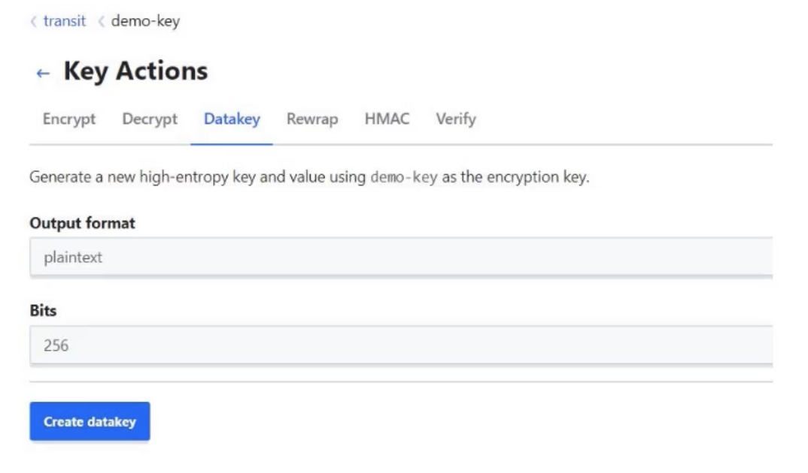
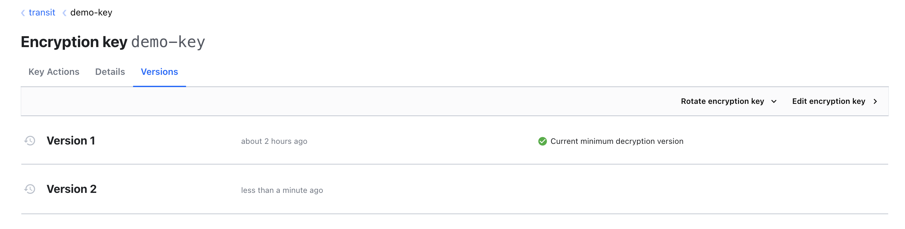
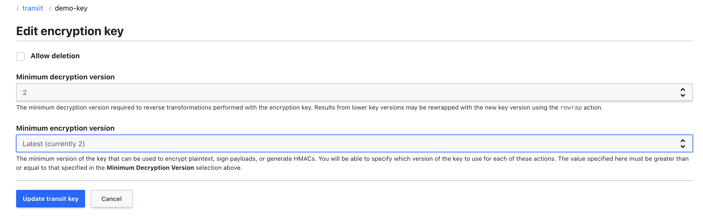
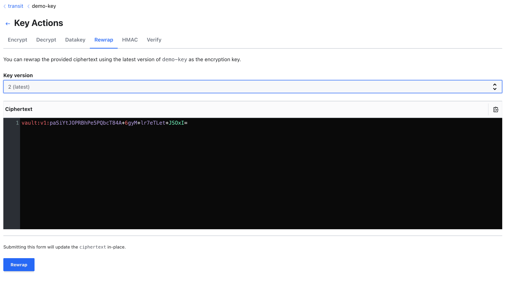

Vault's transit secrets engine handles cryptographic functions on data-in-transit.  
vault does not store the data sent to the secrets engine, so it can also be viewed as encryption as a service.   

Instead of developing and managing cryptographic releated operations, application developer can put the burden to the vault.  

**GUI:**   

Enable secret engine --> transit --> path --> Enable Engine  
transit --> create encryption key  

Multiple crypographic operations available in transit are   

* Encrypt
* Decrypt
* DataKey
* Rewrap
* HMAC
* Verify

transit engine is extensively used for encrypt and decrypt operations.  

transit --> key --> key actions --> encrypt --> print something --> encrypt --> provides Ciphertext in the form of `vault:v1:xxxxxx`   

vault will not store the encrypted the data.

To decrypt:
decrypt --> provide Ciphertext --> provides plaintext
`plaintext provided is base64 encoded.`  

**CLI:**   
To encrypt:  
`vault write transit/encrypt/<keyname> plaintext=<base64 encoded text>`   
This provides the resultant Ciphertext

To Decrypt:   
`vault write transit/decrypt/<keyname> ciphertext=<ciphertext>`    
This provides base64 encoded text   

Through GUI, while we are using encrypted, we can give the plaintext and vault will encode it for us. If we want to provide encoded text, then check the box which says the data is encoded already.   

## Dealing with Large Data

When you encrypt your data, the encryption key used to encrypt the plaintext is referred to as a datakey.  

This datakey needs to be protected so that encrypted data cannot be decrypted easily by an unauthorized party.   

When the data size is large (like 10GB), we do not want to send it over the network to vault and get the encrypted data back. It will increase the latency and slow things down.  

Instead, we can generate a datakey and encrypt it locally and use the same datakey to decrypt it locally when needed.  

**GUI**:   

transit --> key --> Datakey --> plaintext --> Create datakey  
This provides plaintext and ciphertext data keys.

We can encrypt our files with the plaintext datakey.

To get the plaintext datakey in later point of time, we can just decrypt the Ciphertext datakey.  

The ciphertext generated is the encrypted value of plaintext datakey.  

We can use the same plaintext key to decrypt the encrypted data.  

### Best Practices

* Whenever you generate a data key in plain-text, the response contains the plaintext of the datakey as well as it's ciphertext.  

* Use the plaintext to encrypt the blob. Store the ciphertext of your datakey wherever you want. you can store it in the key/value secrets engine.  

When you need to decrypt the blob, request vault to decrypt the ciphertext of your datakey, so that you can get plaintext back to decrypt the blob locally.  

## Important Features

### Key rotation in vault

It is not recommended to encrypt all of our data with one encryption-key.  

Transit engine allows customers to perform the encryption key rotation.  

Vault maintains the versioned keyring and the operator can decide the minimum version allowed for decryption operations.  

To rotate the key:  
transit --> key --> versions --> rotate encryption keys  

While encrypting the data, we can select which we need to use to encrypt particular data.  

If we use v2 to encrypt the data, our resultant ciphertext will be something like `vault:v2:xxxxxx`  

### Min Decrypt version

With multiple versions of keys, with the help of `min_decryption_version`, we can plan on which data can get decrypted.   

By disallowing decryption of old versions of keys, found ciphertext to obsolete (but sensitive) data cannot be decrypted, but in an emergency, the min_decryption_version can be moved back to allow for legitimate decryption.  

All the data encrypted with version2 can be decrypted and all the data encrypted with version1 cannot be decrypted.  

transit --> key --> edit encryption key --> minimum decryption version to 2.

With this, we cannot decrypt or encrypt with version1 key.  

If we want to enable version1 decryption, we can do that by    
transit --> key --> edit encryption key --> minimum decryption version to 1.

### Rewrapping the data

Vault provides an easy way of re-wrapping encrypted data when a key is rotated.  

Vault entity can send data encrypted with an older version of the key to have it re-encrypted with the latest version.  

re-wrapping the data with version2 which is encrypted with version1 datakey.  

This makes decryption easy though the min_decrypt_version is the latest version.  

