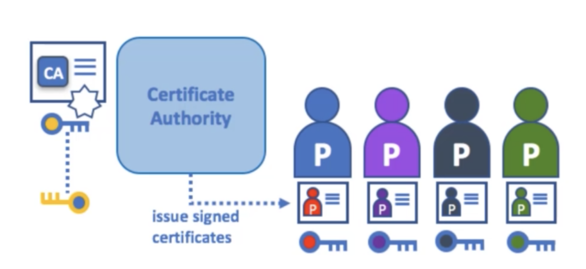
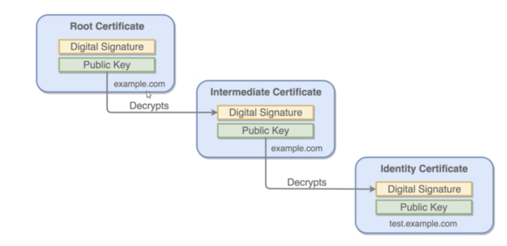

## Certificate Authority

Certificate Authority is an entity which issues digital certificates.  

Key part is that both the receiver and sender trusts the CA.  

### Traditional Process

1. Generate a certificate Sigining request (CSR)  
- Generate public/private keys
- Generate CSR and sign it with private key.  

2. Submit CSR to Certificate Authority and Get it signed.  

### PKI Secret Engine

PKI Secret Engine generates dynamic X.509 certificates.  

With this secrets engine, services can get certificates without going through the usual manual process of generating a private key and CSR, submitting to a CA and waiting for a verification and signing process to complete.   

## Benefits of PKI in vault

* Vault can act as intermediate CA, from the intermediate certificates, we can go ahead and sign the identity certificates.   
* Reducing, or eliminating certificate revocations.  
* Reduces time to get certificate by eliminating the need to generate a private key and CSR.  

