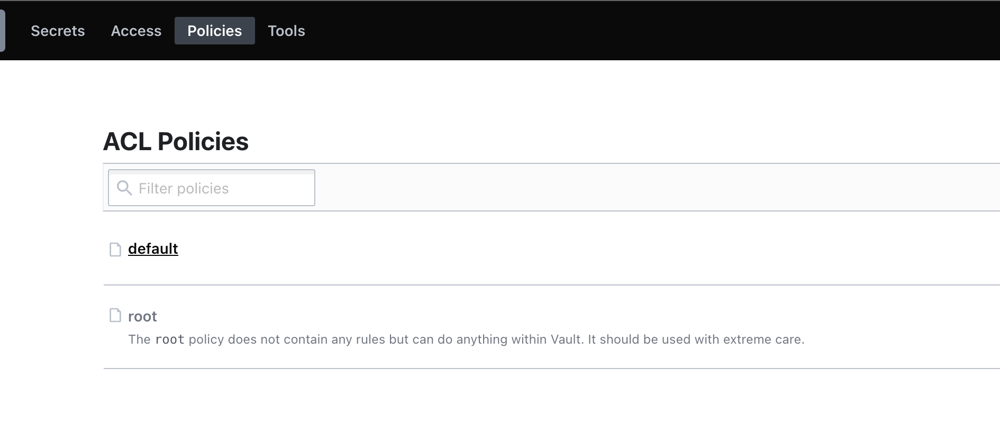
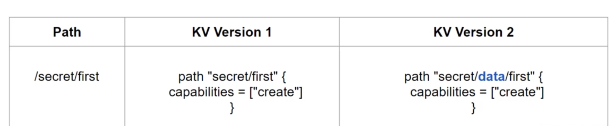
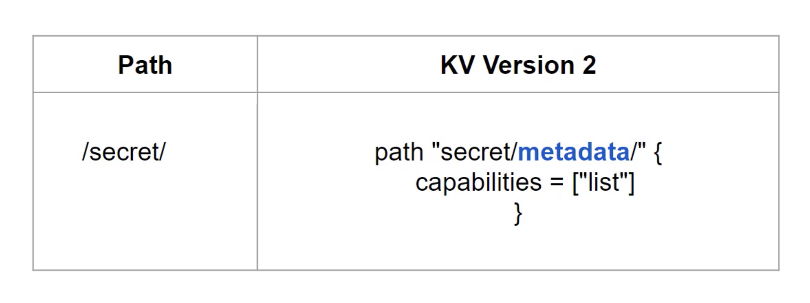
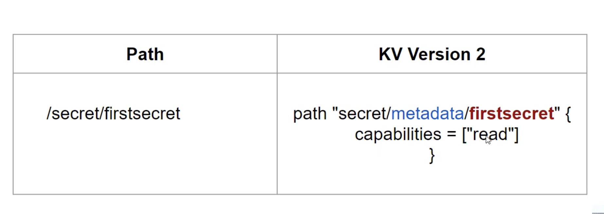
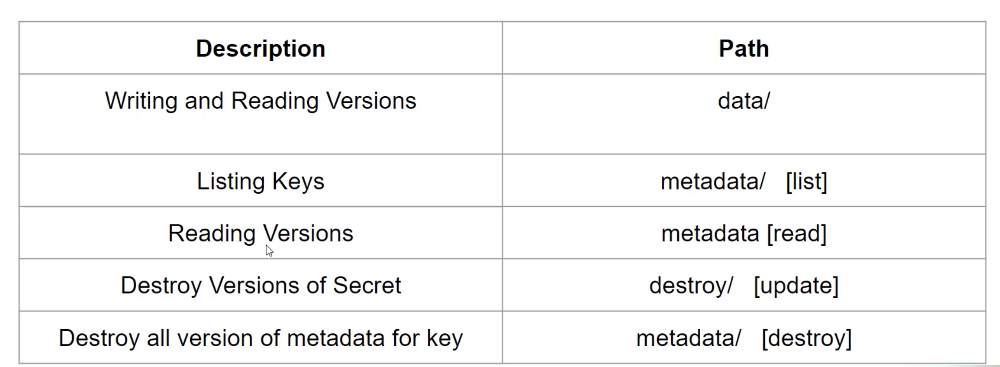

Vault policies define the level of access a user maintains.  

One user has a policy which allows him to Read from secret path, other has a policy which allows him to Read and write from secret path and other user has a policy which allows him to Read, Write, Update, Delete from secret and should be able to work with auth methods.  
So, based on what access the user should have or what the user intends to do, we can create appropriate vault policy for them.  

## Pre-Defined policies in vault

* When we first initialize vault, the root policy gets created by default. The root policy is a special policy that gives superuser access to everything in vault.  
This allows the superuser to set up the initial policies, auth methods etc,.

In addition, another built-in policy, default is created. The default policy is attached to all tokens and provides common permissions.  




## Basics of policy writing

* Policies written in HCL format are often referred as ACL policies. 

Everything in vault is path based, and admins write policies to grant or forbid access to certain paths and operations in vault.  

```
path "auth/*"
{
  capabilities = ["create", "read", "update", "delete", "list", "sudo"]
}
```

### Basic Format

An empty policy grants no permission in the system.  

Therefore ACL(access control list) policies are defined for each path.  

```
path "<PATH>"
{
  capabilities = [ "<LIST_OF_CAPABILITIES>" ]
}
```

Some of the Important capabilities are

* Create
* Read
* Update
* Delete
* List
* Sudo
* Deny

**In CLI:**   
`vault login -method=userpass username=admin password=admin`
```
is already stored in the token helper. You do NOT need to run "vault login"
again. Future Vault requests will automatically use this token.

Key                    Value
---                    -----
token                  s.mAV3QdVN4WaOZcU97Ggi7YI9
token_accessor         DlG4G1p6ClkamYQqqEbVtIQH
token_duration         768h
token_renewable        true
token_policies         ["default"]
identity_policies      []
policies               ["default"]
token_meta_username    admin
```

Here default policy (which is very restrictive) is attached to the user.  
With this user, `vault secrets list` throws an error saying permission denied. 
```
Error listing secrets engines: Error making API request.

URL: GET http://127.0.0.1:8200/v1/sys/mounts
Code: 403. Errors:

* 1 error occurred:
        * permission denied
``` 

To Create a new policy  
**IN GUI**
Policies --> Create ACL policy
```
path "sys/mounts"
{
 capabilities = ["Read"]
}
```

Once the policy is created, we have to associate it with the given user.  

Access --> Auth methods --> userpass --> admin --> edit the user --> Under token, we need to specifiy the name of the policy in Generated Token's policies. --> Add --> save.

Once we have assoociated new policy with the user, that policy would not work with the existing token, we have to generate the new token.  

For paths,  
we can give wild card like `secret/*` which indicates all the paths under secret.  
we can also provide `secret/+/first-secret` + formulates the path accordingly, instead of specifying longer path.  

## Root Protected API Endpoints

Some of the paths are more restrictive and requires a root token or sudo capability in the policy.  

* auth/token/accessors
* auth/token
* sys/audit
* sys/rotate
* sys/seal


## ACL rules Format - KV V2

The version 2 kv store uses a prefixed API, which is different from the version1 API. 

Writing and reading versions are prefixed with the data/ path in kv version2.



## Listing Secrets

The metadata/endpoint returns the list of key names at the specified location.

To list all the secrets inside the path, we need to use `metadata`. 



This plays major role for GUI, as when click on the path, if the user does not have list policy, we cannot able to open any path (no listings).

## Reading Secret metadata

This endpoint retrives the metadata and versions for the secret at the specfied path.  






