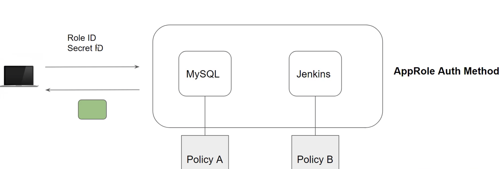
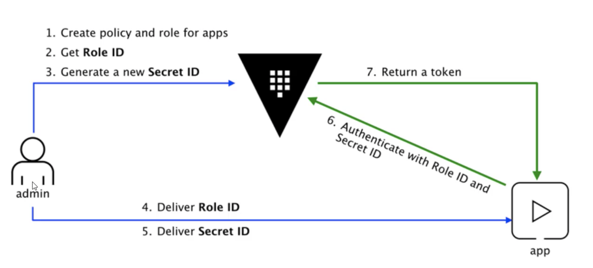

The Approle auth method allows multiple roles to be defined corresponding to different applications, each with different levels of access.  

Role1 --> PolicyA
Role2 --> PolicyB

For AppRole method, roleId and secretId are used for authentication(like username and password).

In GUI:   
Access --> Auth Methods --> Enable new method --> AppRole --> Create

Create policies
Policies --> ACL Policies -->  Create new policy

To attach the policy for the role   
`vault write auth/approle/role/jenkins token_policies="jenkins_role_policy"`    

`vault read auth/approle/role/jenkins`  

To get role-id  
`vault read auth/approle/role/jenkins/role-id`   

To get sceret-id   
`vault write -f auth/approle/role/jenkins/secret-id`  
This provides secretId and secretId-accessor.  

For Authentication   
`vault write auth/approle/login role_id="<>" secret_id="<>"`  

