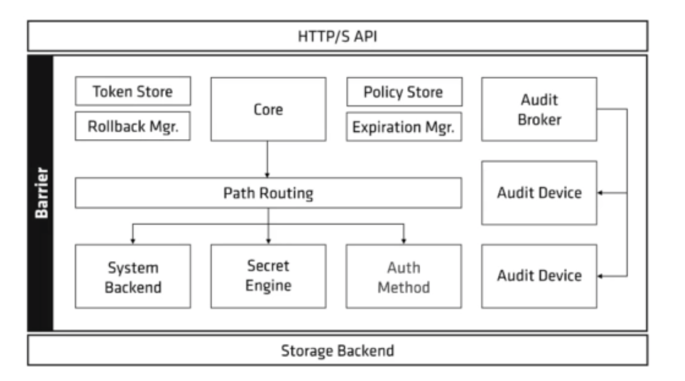
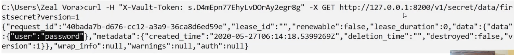

All of the vault capabilities are accessible via the HTTP API.  

Some of the vault features are not available via the CLI and can only be accessed via the HTTP API.  

We can make use of curl, to send a request to vault and get the response.  

To perform curl operation, we need to make use of client token. The client token can be set with the `X-Vault-Token` HTTP header within the request.  

`curl -H "X-Vault-Token: <Token> -X GET http://127.0.0.1:8200/v1/secret/data/first-secret?version=1`  

