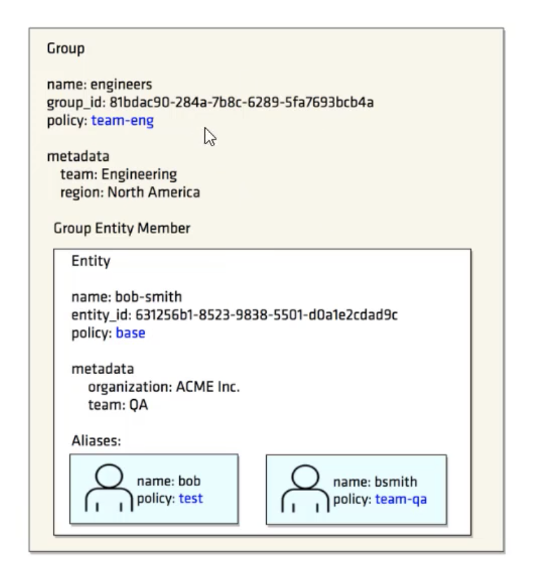

## Token Capabilities

The token capabilities command fetches the capabilities of a token for a given path.  

`vault token capabilities sys/`  
`vault token capabilities cubbyhole/`   

If a token is provdided as an argument, the "sys/capabilities" endpoint and permission is used.  

If no token is provided, the "sys/capabilities-self" endpoint and permission is used with the locally authenticated token.  

To get the capabilities of specific token  
`vault token capabilities <token> sys/`   

## Entities and Aliases

Vault supports multiple authentication methods and also allows enabling the same type of authentication method on different mount paths.  

Each vault client may have multiple accounts with various identity providers that are enabled on the vault server.  

Vault --> Access --> entities

### Identity Secret Engine

The Identity secrets engine maintains the clients who are recognized by vault.  

Each client is internally termed as an entity. An entity can have multiple aliases.  

This secret engine will be mounted by default. This secrets engine cannot be diabled or moved.  

## Identity Groups

An Identity group can contain multiple entities as its members.  

Policies set on the group is granted to all members of the group.

By default vault creates an internal group.  

Many organizantions already have groups defined within their external identity providers like Active Directory.  

External groups allows to link vault with the external identity provider (auth provider) and attach approriate policies to the group.  

