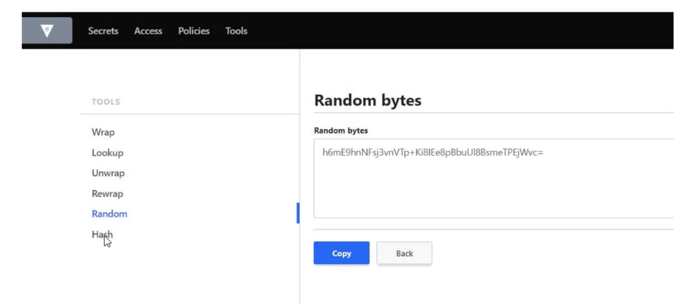
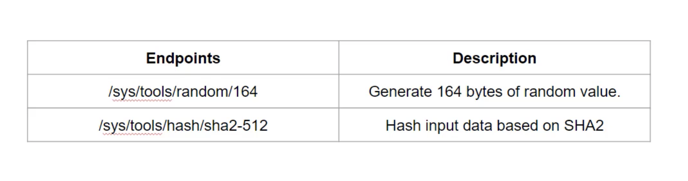

Tools are available at `sys/tools` endpoint.  

Random -- to generate random bytes as specified in the specified output format.

Hash - Hashes the data with specified algorithm and a specified output format.  
If we have space in our data, Hash cannot able to hash the data. So, better to encode our data and do hash on that.  

### Vault autocompletion

To install autocomplete feature     
`vault -autocomplete-install`   

After installing autocompleting, we need to restart our shell session.

Be sure to restart your shell after installing autocompletion..   

