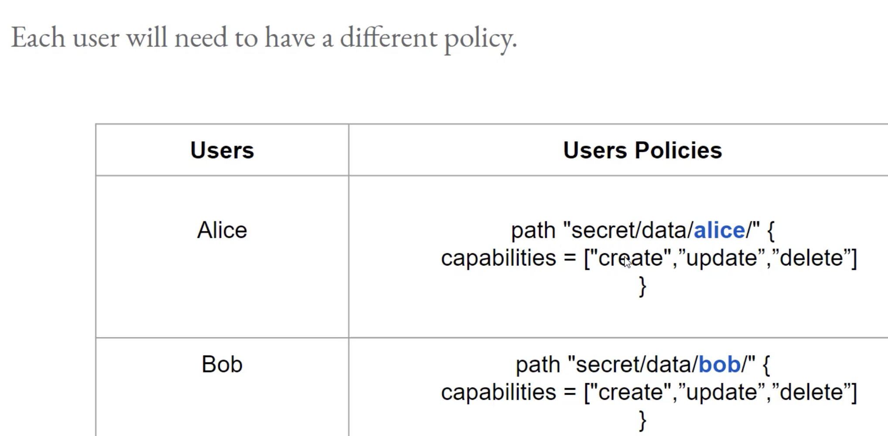
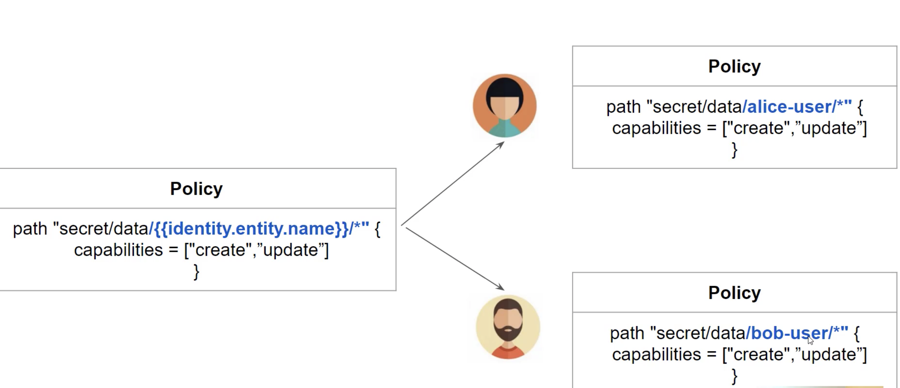

Let's assume secret has two prefixes   
- /secret/alice   
- /secret/bob   

   

**Path Templating** allows variable replacement based on information of the entity.  

path template Policy as below
```
path "secret/data/{{identity.entity.name}}/*" 
{
  capabilities = ["create", "update", "delete"]
}
```

 

For this to work, we need to have an entity alice-user with the alias alice and entity bob-user with the alias bob.

entities should be attached with the path template policy.

 