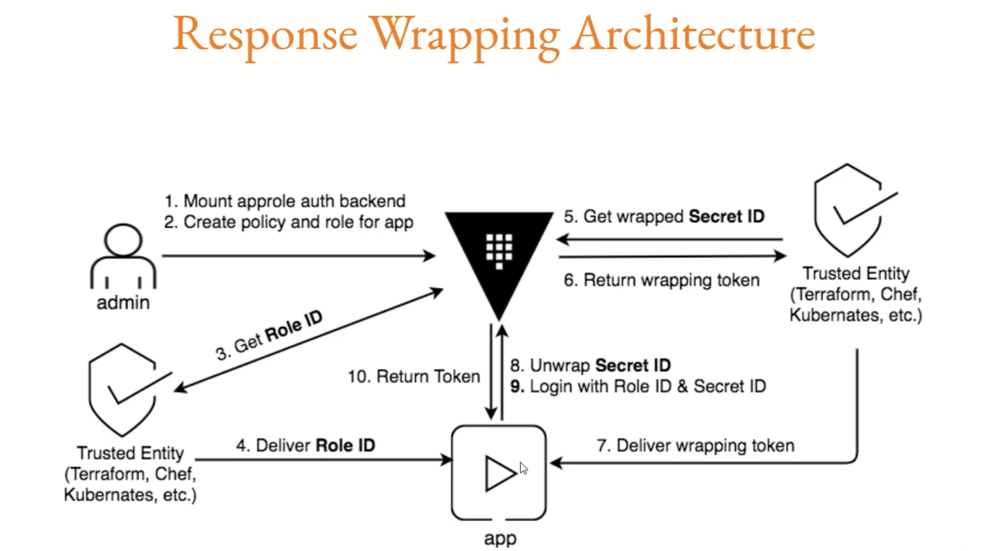

When response wrapping is requested, vault creates a temporary single-use token (wrapping token) and insert the response into the token's cubbyhole with a short TTL.  

Only the expecting client who has the wrapping token can unwrap this secret.  

If wrapping token is compromised and attacker unwraps the secret, the application will not be able to unwrap again and this can sound an alarm and we can revoke things accordingly.  

To create wrapping token   
`vault token create -wrap-ttl=600`   
This wrapping token can be unwrapped only once and from this wrapping token, we can fetch the appropriate token. Once the apropriate token is fetched, then wrap token will no longer work.

To unwrap the token   
`vault unwrap <wrapped token>`  

Use-case for wrapping toke in Approle, where secretId can be wrapped and sent. Only pplication can unwrap the secretId.  

