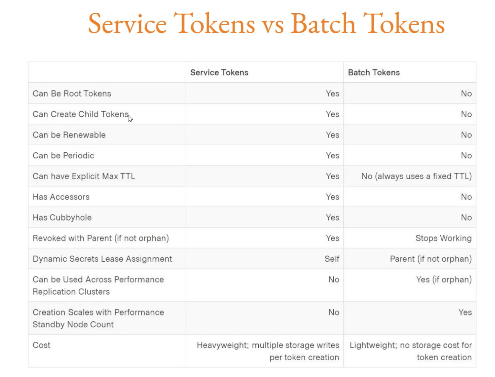

Batch tokens are encryoted blobs that carry enough information for them to be used for vault actions, but they require no storage on disk to track them.   
Even with vault replication enabled, the pressure on the storage backend increases as the number of token or lease generation requests increase.  

Since batch tokens does not require storage on disk and hence are extremely lightweight and scalable but lack most of the elexibility of the service token.  



To create batch token   
`vault token create -type=batch -policy=default`    

## TTL Configuration   

### TTL Depenedency

The TTLs are dependent on combination of multiple factors:

* The system's max TTL which is 32 days, but this can be changed in vault's configuration file.  
* The max TTL set on a mount using mount tuning.  
* A vaule suggested by auth method that issued the token.  

For defaukt values  
`vault read sys/mounts/auth/token/tune`   
```
Key                  Value
---                  -----
default_lease_ttl    768h
description          token based credentials
force_no_cache       false
max_lease_ttl        768h
token_type           default-service
```

To modify the default values   
`vault write sys/mounts/auth/token/tune default_lease_ttl=5m max_lease_ttl=10m`   
```
Success! Data written to: sys/mounts/auth/token/tune
Advaiths-MacBook-Pro:HashiCorp-Vault ram$ vault read sys/mounts/auth/token/tune
Key                  Value
---                  -----
default_lease_ttl    5m
description          token based credentials
force_no_cache       false
max_lease_ttl        10m
token_type           default-service
```
This TTL is for token authentication methods. This varies for different authentication methods.  

## Periodic Tokens

Periodic Tokens never expire provided that they are renewed.
(When we want a token to work as well as the corresponding service is running).

Outside of root tokens, it is currently the only way for a token in vault to have an unlimited lifetime.  

Though we continuously renew the service tokens, we cannot make the token unlimited. 
We cannot renew the TTL more than the deafult max_lease_ttl configured at sys/mounts/auth/token/tune.  

To create periodic tokens  
`vault token create -period=30m -policy=default`  
```  
Key                  Value
---                  -----
token                s.fMhcVeDkG7GohGX40iPW1RVD
token_accessor       8V2nMGWHr817ak0r4q2BOQV3
token_duration       30m
token_renewable      true
token_policies       ["default"]
identity_policies    []
policies             ["default"]
```

With regards to periodic token, our service will renew the token in the timely manner. Once the service is down, the token won't be renewed further and token will be revoked.  


