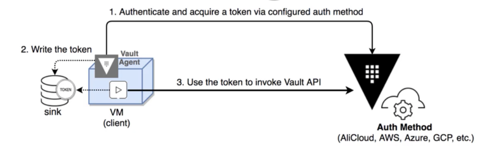
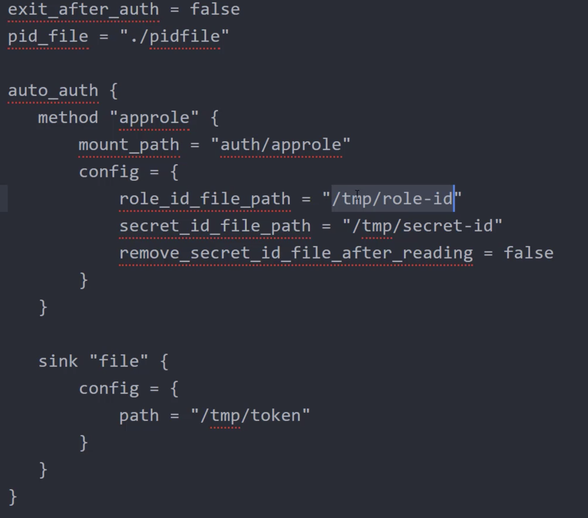
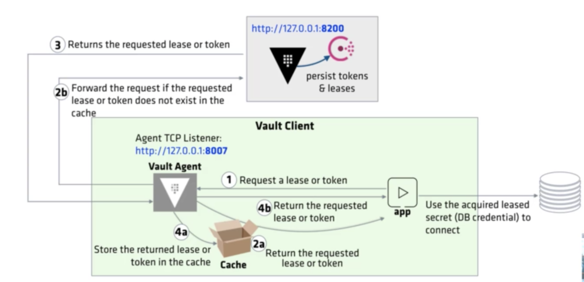

Vault Agent is a client daemon which automates the workflow of client login and token refresh.  

* Automatically authenticates to vault for those supported auth methods.  
* Keeps token renewed (re-authenticates as needed) until the renewal is no longer allowed.  
* Designed the robustness and fault tolerance.  



To run the vault agent, we can run the vault binary in agent mode.   
`vault agent config=<config file>`   

The agent configuration file must specify the `auth method` and `sink locations` where the token to be written.  

When the agent is started, it will attempt to acquire a vault token using the auth method specified in the agent configuration file.  

On successful authentication, the resulting token is written to the sink locations.  

Whenever the current token value changes, the agent writes to the sinks.  

In GUI:   
First enable AppRole method.  
`vault auth enable approle`  

`vault write auth/approle/role/vaultagent token_policies="agent_policy"`   

agent-policy   
```
path "auth/token/create"
{
  capabilities = ["update"]
}
```

To get the role-id  
`vault read auth/approle/role/vaultagent/role-id`   

To fetch the secret-id  
`vault write -f auth/approle/role/vaultagent/rsecret-id`  

**Vault-agent config file**



We also need to specify   
vault{
  address= "127.0.0.1:8200`  
}

Before running this, we need to ensure that the role-id and secret-id are available in the specified paths.  

`vault agent -config=<filename>`  

Here we have vault and vault-agent on the same server.

## Vault agent caching

Two primary functionalities of vault-agent:

* Auto-auth : Automatically authenticate to vault and manage the token renewal process.  
* Caching: Allows client-side caching of responses containing newly created tokens.  

Vault Caching allows client-side caching of responses containing newly created tokens and responses containing leased secrets generated off to these newly created tokens.  



We need to include the following in the agent config file:     
* cache and listener "tcp" blocks.  
* export VAULT_AGENT_ADDR="http://127.0.0.1:8007"  
request will be redirected to vault agent.  


