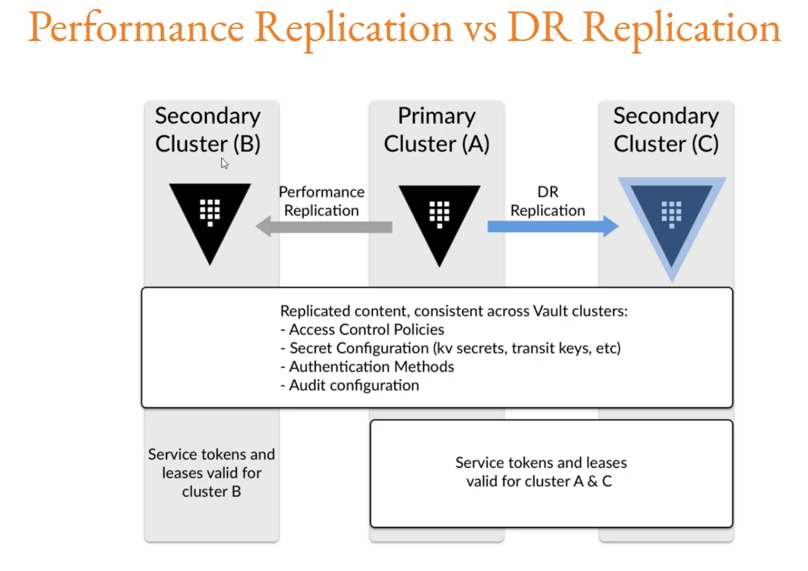

To enable auditing  
`vault audit enable file file_path=<filename>.log`  
Path where audit device is enabled.    

Once the auditing is enabled, logs will be stored.    

To get the token  
`vault print token`  

## namespace

`vault namespace list`  

`vault namespace create ns1/`  

`vault namespace delete ns1/`  

`vault namespace lookup ns1/`   

## Replication

Performance replication - both primary and secondary takes user requests actively (both shares the configuration)
Disaster replication - Secondary won't take any client requests and this can be promoted as primary in case of disaster.  

## Telemetry

Telemetry describes the datasets that is coming out from a specific device.  

This allows us to collect measurements to generate insights.  

